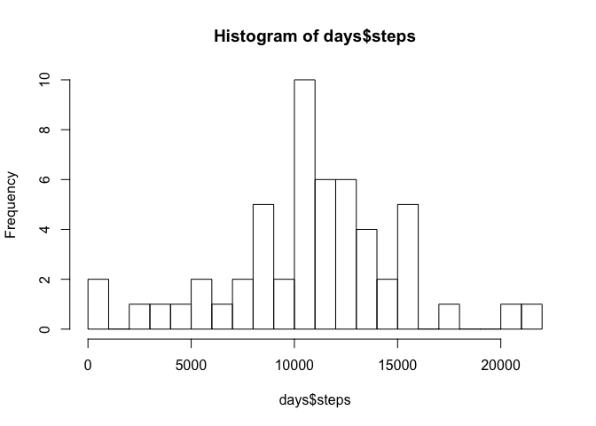
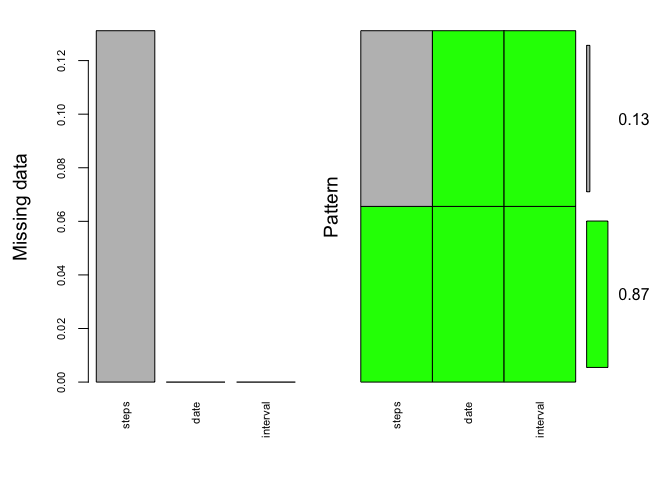
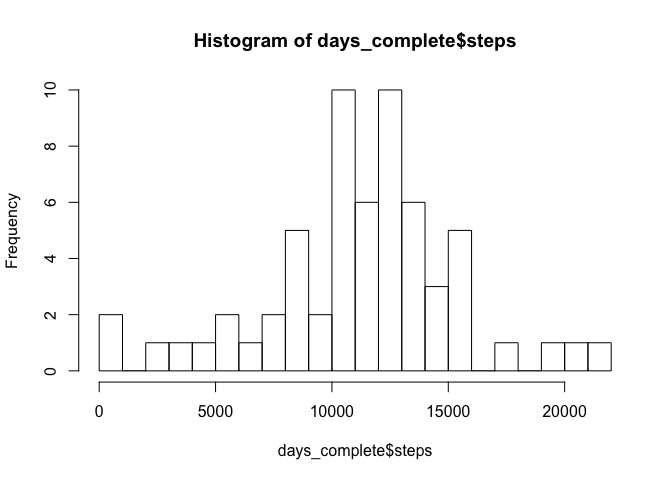
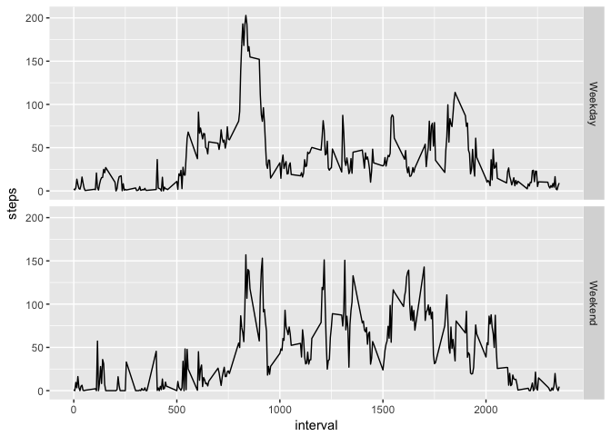

# Reproducible Research: Peer Assessment 1


## Loading and preprocessing the data

No initial pre-processing to do; will restructure as needed to address subsequent sections.


```r
library(ggplot2)
library(mice)
library(VIM)

activity <- read.csv("activity.csv",header = T)
```


## What is mean total number of steps taken per day?

Here, we will aggregate the dataset by date--summing up the steps--and then perform calculations.


```r
days <- aggregate(steps~date, data = activity, FUN = sum)
hist(days$steps, breaks = 20)
```

<!-- -->

```r
mean(days$steps)
```

```
## [1] 10766.19
```

```r
median(days$steps)
```

```
## [1] 10765
```


## What is the average daily activity pattern?

Next, we will aggregate the origianl dataset now by interval--averageing the numbers steps--and then perform calculations.


```r
ints <- aggregate(steps~interval, data = activity, FUN = mean)
qplot(interval, steps, data = ints, geom = "line")
```

<!-- -->


The interval with the maximum number of steps is:

```r
ints[ints$steps == max(ints$steps),]
```

```
##     interval    steps
## 104      835 206.1698
```


## Imputing missing values

There are a lot NAs on the steps variable:


```r
md.pattern(activity) # show the missing values
```

```
##       date interval steps     
## 15264    1        1     1    0
##  2304    1        1     0    1
##          0        0  2304 2304
```

```r
activity_plot <- aggr(activity, col=c('green','gray'),
                  numbers=TRUE, sortVars=TRUE,
                  labels=names(activity), cex.axis=.7,
                  gap=3, ylab=c("Missing data","Pattern"))
```

<!-- -->

```
## 
##  Variables sorted by number of missings: 
##  Variable     Count
##     steps 0.1311475
##      date 0.0000000
##  interval 0.0000000
```


To address this we will use the mice package to create multiple (5) imputed datasets and then combine them into a master set.  The method we will use is "Predictive Mean Matching" (PMM), which has the benefit of working with non-normal variables.


```r
activity_imputed <- mice(activity, m=5, maxit = 5, method = 'pmm')
```

```
## 
##  iter imp variable
##   1   1  steps
##   1   2  steps
##   1   3  steps
##   1   4  steps
##   1   5  steps
##   2   1  steps
##   2   2  steps
##   2   3  steps
##   2   4  steps
##   2   5  steps
##   3   1  steps
##   3   2  steps
##   3   3  steps
##   3   4  steps
##   3   5  steps
##   4   1  steps
##   4   2  steps
##   4   3  steps
##   4   4  steps
##   4   5  steps
##   5   1  steps
##   5   2  steps
##   5   3  steps
##   5   4  steps
##   5   5  steps
```

```r
activity_complete <- complete(activity_imputed)
```


Performing the same calculations as we did on the original dataset, we see the averages (means and medians) are now substantially higher.  Without imputing, our data would have under-reported these figures.  Imputing increased them to the correct actual levels.


```r
days_complete <- aggregate(steps~date, data = activity_complete, FUN = sum)
hist(days_complete$steps, breaks = 20)
```

<!-- -->

```r
mean(days_complete$steps)
```

```
## [1] 11200.23
```

```r
median(days_complete$steps)
```

```
## [1] 11458
```


## Are there differences in activity patterns between weekdays and weekends?

To answer these, we first determine the day of the week for each date, and then if that day is a weekday or weekend.  We then aggregate (average) based on that determination and plot.


```r
activity_complete$date <- as.Date(activity_complete$date)
activity_complete$weekday <- weekdays(activity_complete$date)
activity_complete$dayType <- ifelse(activity_complete$weekday %in% c("Saturday", "Sunday"),
                                    "Weekend", "Weekday")
ints_complete <- aggregate(steps~interval+dayType, data = activity_complete, FUN = mean)
qplot(interval, steps, data = ints_complete, facets = dayType~., geom = "line")
```

<!-- -->


